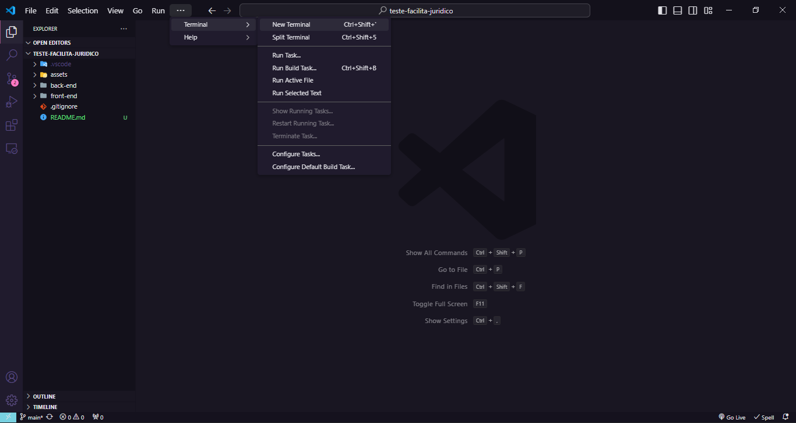
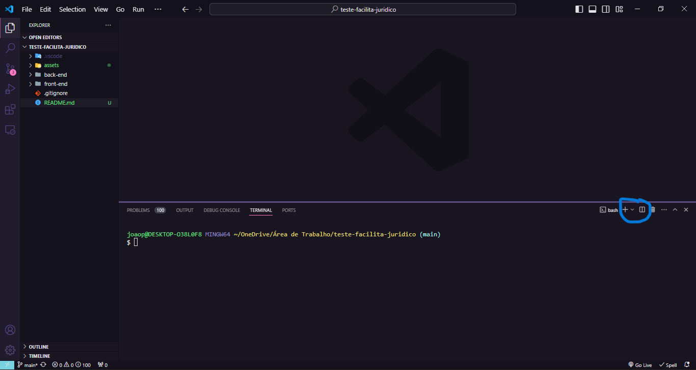

<h1 align="center"> Teste Prático Facilita Jurídico </h1>

Este repositório contém o desenvolvimento do teste prático para a vaga de Desenvolvedor Júnior da Facilita Jurídico.

  <a href="#-tecnologias">Tecnologias</a>&nbsp;&nbsp;&nbsp;|&nbsp;&nbsp;&nbsp;
  <a href="#-projeto">Projeto</a>&nbsp;&nbsp;&nbsp;|&nbsp;&nbsp;&nbsp;
  <a href="#-funcionalidades">Funcionalidades</a>&nbsp;&nbsp;&nbsp;|&nbsp;&nbsp;&nbsp;
  <a href="#-como-rodar-o-projeto-localmente">Como rodar o projeto localmente</a>

 

## 🚀 Tecnologias

Este projeto foi desenvolvido com as seguintes tecnologias:

Front-end:

- ReactJS
- styled-components
- react-icons
- react-router-dom
- axios

Back-end:

- Node.js
- Express
- express-async-errors
- SQLite e SQLite3
- knex
- cors

## 🗂️ Projeto

CleanHouse é uma plataforma desenvolvida para auxiliar uma empresa de limpeza residencial no gerenciamento de seus clientes e na otimização de rotas de atendimento. A empresa enfrentava desafios no controle das informações dos clientes, que eram gerenciadas em planilhas, e buscava uma solução eficiente para centralizar e visualizar esses dados, além de otimizar as rotas de atendimento para maximizar a eficiência na visitação dos clientes.

## ⚙️ Funcionalidades

Este projeto possui as seguintes funcionalidades:

- Página Home e Cadastro de clientes;
- Cadastrar novos clientes;
- Filtrar clientes pelo nome;
- Modal que mostra a melhor rota de atendimento, com base nas informações no banco de dados.

## 💻 Como rodar o projeto localmente

Para rodar o projeto em sua máquina localmente e testá-lo, você precisa ter os seguintes requisitos:

- Node.js v18.17.0
- VSCode

Com o Node.js instalado e o VSCode pronto, basta baixar o repositório e abri-lo no VSCode. Abra duas janelas de terminal no próprio VSCode, uma para acessar a pasta back-end e outra para o front-end. Na imagem a seguir é demonstrado onde você pode abrir um novo terminal:

Você pode abrir um novo terminal ou dividir o terminal em dois, na imagem a seguir é sinalizado as duas opções:

Para acessar a pasta back-end e front-end use o comando "cd back-end" e "cd front-end" em terminais diferentes.

Em cada janela, você deve instalar as dependências necessárias do projeto com o comando "npm install". Depois de finalizar as instalações, você deve usar o comando "npm run dev" em ambas as janelas. Na janela do front-end, aparecerá o link para você acessar no seu navegador. Ao acessar, você pode testar as funcionalidades do projeto.
